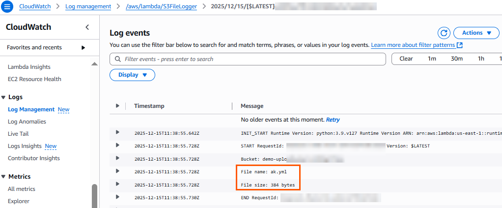

# S3 Put Event Trigger Lambda Demo

This demo project shows how to use **AWS CloudFormation** to deploy a Lambda function that is triggered by an **S3 PUT event**. When a file is uploaded to the S3 bucket, the Lambda function logs the file name and size to **CloudWatch Logs**.

---

## Features

- Creates an S3 bucket with event notification for object created (PUT) events  
- Deploys a Python Lambda function that logs file details  
- Sets up the necessary IAM role and permissions  
- Demonstrates real-time logging of uploaded files to CloudWatch  

---

## Deployment

Use the AWS CLI to deploy the CloudFormation stack:

```bash
aws cloudformation deploy \
  --template-file s3-lambda.yaml \
  --stack-name s3-lambda-stack \
  --capabilities CAPABILITY_NAMED_IAM
````

---

## Testing

1. Upload a file to the newly created bucket:

```bash
aws s3 cp test.txt s3://<BucketNameFromOutputs>/
```

2. Check the Lambda logs in CloudWatch Logs under the log group `/aws/lambda/S3FileLogger`.

You should see log entries showing the file name and size.

---

## Notes

* The bucket name is autogenerated to avoid conflicts.
* The Lambda function logs file details only on new uploads.
* This is a demo; for production, customize the bucket name and add error handling.

---

## Screenshot



---

## References

* [AWS Lambda Developer Guide: Using AWS Lambda with Amazon S3](https://docs.aws.amazon.com/lambda/latest/dg/with-s3-example.html)
* [AWS CloudFormation User Guide](https://docs.aws.amazon.com/AWSCloudFormation/latest/UserGuide/Welcome.html)
* [Amazon S3 Event Notifications](https://docs.aws.amazon.com/AmazonS3/latest/dev/NotificationHowTo.html)

---
